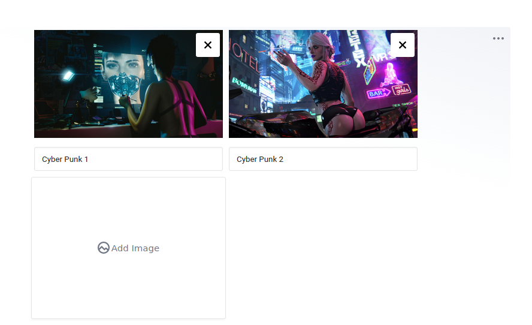

# EditorJS Image Carousel

**This package is based on [carousel-editorjs](https://github.com/mr8bit/carousel-editorjs)**.
Forked since [80c9ac9](https://github.com/mr8bit/carousel-editorjs/commit/80c9ac965434ad359991dcd6c85cf540b7bc5a8b)

## Fork Changes
- Allow return and apply custom parameters
- Fixed styles and UI
- Minor Fixes

---


# Carousel Tool

Carousel/Gallery Block for the [Editor.js](https://editorjs.io).



## Features

- Uploading file from the device
- Preload image

**Note** This Tool requires server-side implementation for file uploading. See [backend response format](#server-format) for more details.

## Installation

### Manual downloading and connecting

1. Upload folder `dist` from repository
2. Add `dist/bundle.js` file to your page.

## Usage

Add a new Tool to the `tools` property of the Editor.js initial config.

```javascript
import Carousel from 'Carousel';

// or if you inject ImageTool via standalone script
const Carousel = window.Carousel;
 
var editor = EditorJS({
  ...

  tools: {
    ...
    carousel: {
        class: Carousel,
        config: {
            endpoints: {
                byFile: "URL_FETCH",
            }
        }
    },
  }

  ...
});
```

## Server Side Implementation
Your backend should return response in format
```json
{
    "success": 1,
    "file": {
        "url": "https://domain.com/path/to/image.png",
        //---
        // you are able to add additional parameters
        //---
    }
}
```
